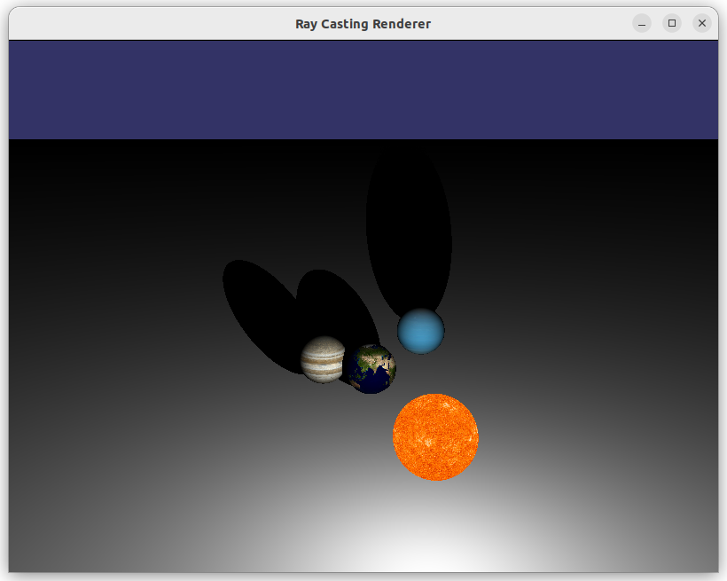
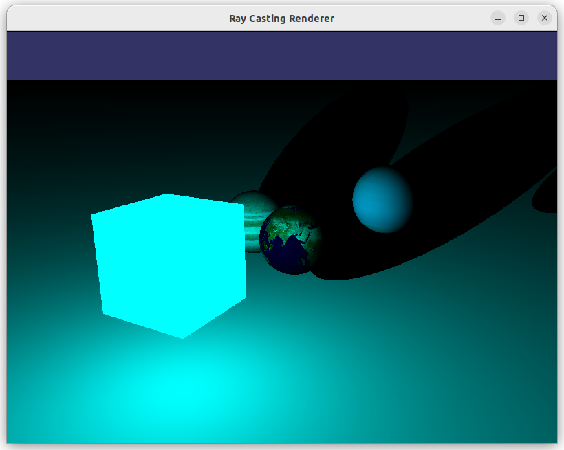
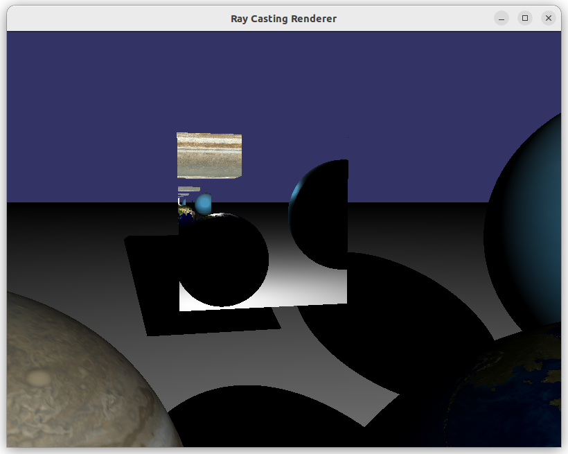
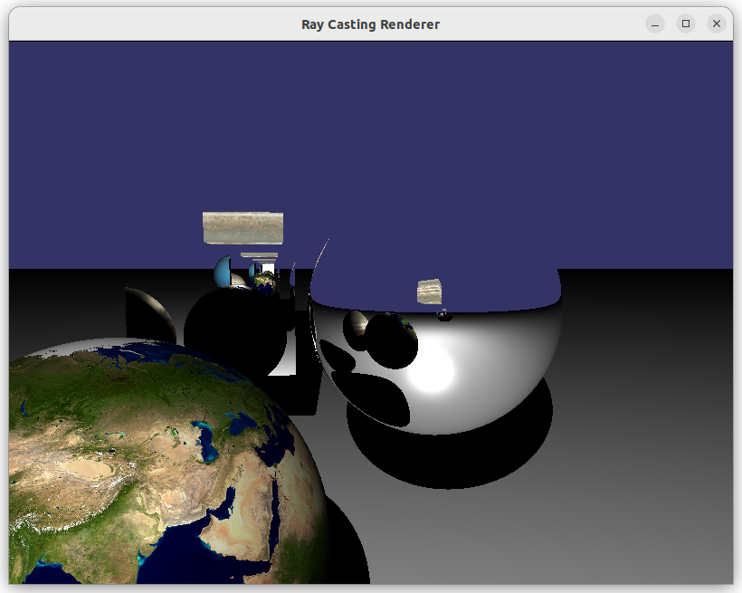
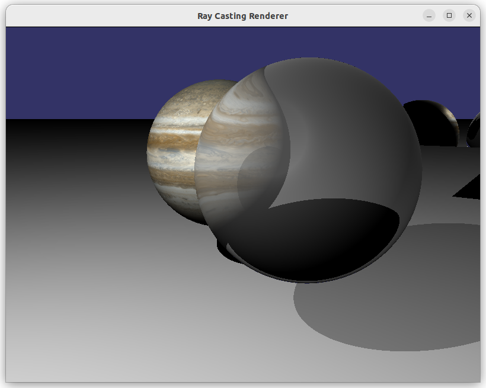
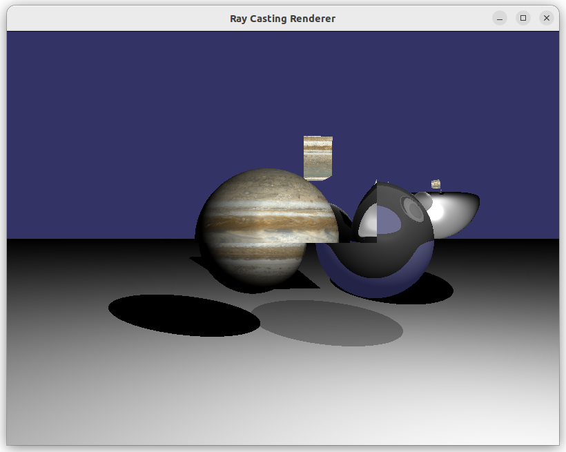

# 🔦 Raycasting com OpenGL (GLUT)

Este é um projeto simples de **ray casting** implementado em **C++ com OpenGL (usando GLUT)** para fins educacionais em disciplinas de Computação Gráfica.

---

## 🚀 Requisitos

- **Compilador:** g++
- **Bibliotecas:** OpenGL + GLUT (ex: freeglut)
- **Ferramentas:** make

### Como instalar dependências (Ubuntu/Debian):

```bash
sudo apt update
sudo apt install build-essential freeglut3-dev
sudo apt install make
```

## 🛠️ Como Compilar e Rodar

Compilar e executar:

```bash
make run
```

(Ou apenas `make` para compilar.)

Limpar compilação:

```bash
make clean
```

Limpar compilação e recompilar:

```bash
make rebuild
```

---

## 🎨 Funcionalidades atuais

- Renderização de cenas 3D usando **ray casting**.
- Propriedades especular e difusa da luz.
- Suporte a **esferas**, **planos** e **caixas** como objetos ou objetos emissores de luz.
- Fontes de luz **pontuais** com diferentes intensidades e cores.
- Câmera com movimentação básica (usando teclado/mouse).
- Texturização de objetos (mapa de textura simples).
- **Reflexividade** (superfícies espelhadas).
- **Transparência** (materiais translúcidos, tipo vidro).
- **Carregamento de cenas via arquivos externos**`.json`.

---

## 🧱 Como Instanciar Objetos

Os objetos e luzes são adicionados diretamente na inicialização da cena (`main.cpp` função `setup()`).

### Exemplo de adição de objetos:

```cpp
Sphere* sphere = new Sphere(
    Vec3(0, 0, -5),  // Centro
    1.0f,            // Raio
    Texture("textures/earth.jpg") // Textura
);
scene.objects.push_back(sphere);
```

```cpp
Plane* plane = new Plane(
    Vec3(0, -1, 0),   // Posição
    Vec3(0, 1, 0),    // Normal
    Texture("textures/floor.png") // Textura
);
scene.objects.push_back(plane);
```

### Exemplo de adição de luz:

```cpp
scene.lightSources.push_back(Light(
    Vec3(5, 5, -3), // Posição
    Vec3(1, 1, 1)   // Intensidade RGB (branco)
));
```

---
## 🧩 Rodar com Cena Externa (Arquivo JSON)
O programa pode ser executado de duas formas:

- Default: Se rodar normalmente (make run), o programa criará uma cena padrão configurada no código (função setup()).

- Arquivo JSON: Se quiser carregar uma cena personalizada, basta passar o nome do arquivo .json como argumento.

 **Exemplos:**

Rodar a cena padrão (default):

```bash
make run
```
Rodar passando um arquivo de cena:

```bash

./jvav_raycasting worlds/exemple.json
```
Certifique-se de que o arquivo .json esteja no mesmo diretório (ou passe o caminho correto).

---
## 📜 Exemplo de Arquivo JSON de Cena
Aqui está um exemplo de arquivo scene.json que cria uma esfera, um plano, uma caixa e uma fonte de luz pontual:

```json
[
    {
      "type": "sphere",
      "center": [0, 1, -5],
      "radius": 1.0,
      "color": [0.2, 0.7, 0.8],
      "specular": 64,
      "reflection": 0.5,
      "transparency": 0.2,
      "refractiveIndex": 1.3,
      "texture": "assets/marble.png",
      "emitter": true
    },
    {
      "type": "plane",
      "point": [0, 0, 0],
      "normal": [0, 1, 0],
      "color": [0.8, 0.8, 0.8],
      "specular": 16,
      "reflection": 0.1,
      "texture": "assets/floor.png"
    },
    {
      "type": "box",
      "minCorner": [-1, 0, -8],
      "maxCorner": [1, 2, -6],
      "color": [1.0, 0.0, 0.0],
      "specular": 32,
      "reflection": 0.3,
      "transparency": 0.5,
      "refractiveIndex": 1.5,
      "texture": "assets/brick.png",
      "emitter": false
    },
    {
      "type": "light_point",
      "position": [5, 10, 5],
      "color": [1.0, 1.0, 1.0]
    }
]
```

---
## 🎮 Controles Modo Camera

**Gerais:**
- **ESC** — Encerrar o programa
- **K** — Ativar/Desativar o **ray casting**
- **T** — Ativar/Desativar monitoramento de tempo de renderização por frame
- **Z/z** — Aumentar/Diminutir quantidade máxima de recastings de raios
- **F/f** — Aumentar/Diminutir o fov da camera
- **x** — Alternar para modo de controle de objetos
- **Mouse** — Girar a câmera

**Modo Câmera:**
- **W / S** — Movimentar camera para frente/trás
- **A / D** — Movimentar camera para esquerda/direita
- **Space** — Subir camera
- **C** — Descer objeyo

**Modo Objeto:**
- ← /→ — Iterar pela lista de objetos no mundo
- **W / S** — Movimentar objeto para frente/trás
- **A / D** — Movimentar objeto para esquerda/direita
- **Space** — Subir objeto
- **C** — Descer objeto
- **L/l** — Aumentar/Diminutir intensidade da luz do objeto (Se for emissor de luz)
- **R/r** — Aumentar/Diminutir intensidade da luz vermelha do objeto (Se for emissor de luz)
- **G/g** — Aumentar/Diminutir intensidade da luz verde do objeto (Se for emissor de luz)
- **B/b** — Aumentar/Diminutir intensidade da luz azul do objeto (Se for emissor de luz)

---


## 🎯 Trabalhos Futuros

Algumas melhorias planejadas para o projeto:

- [ ] **Novos tipos de objetos** (cilindros, cones, meshes).
- [ ] **Anti-aliasing** por amostragem múltipla (supersampling).
- [ ] **Sistema de materiais** mais completo (brilho, rugosidade).
- [ ] **Calcular a diferença entre rasterização e raycasting** em tempo de renderização.
---

## 📄 Licença

Este projeto é de uso livre para fins educacionais e pessoais.

---

# ✨ Preview













