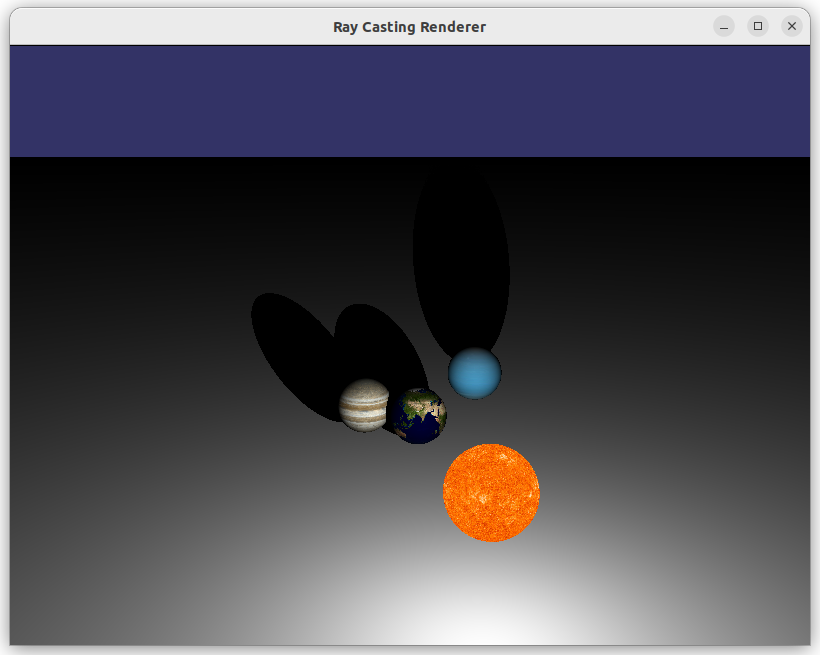
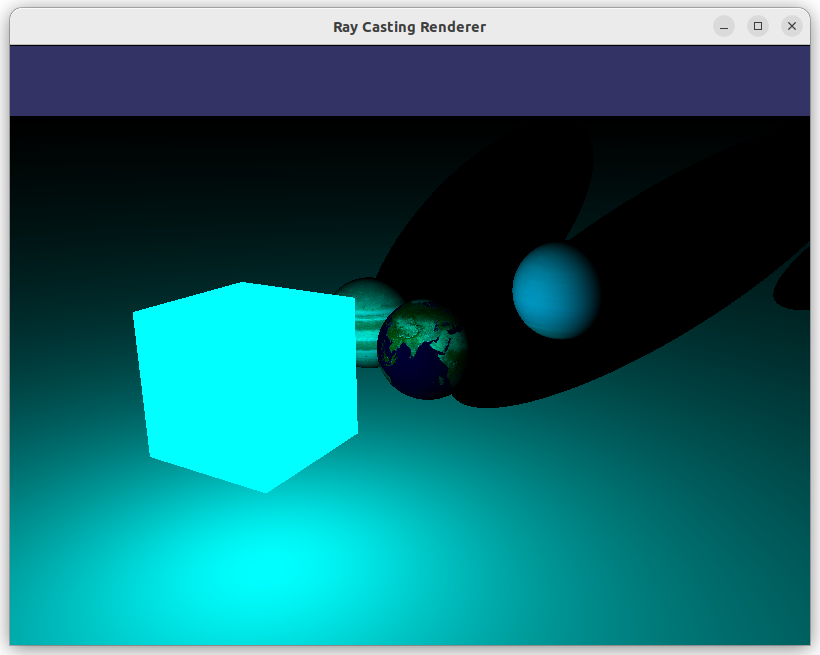
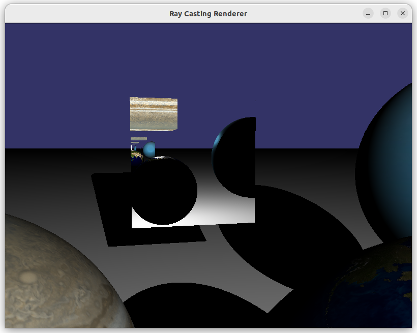
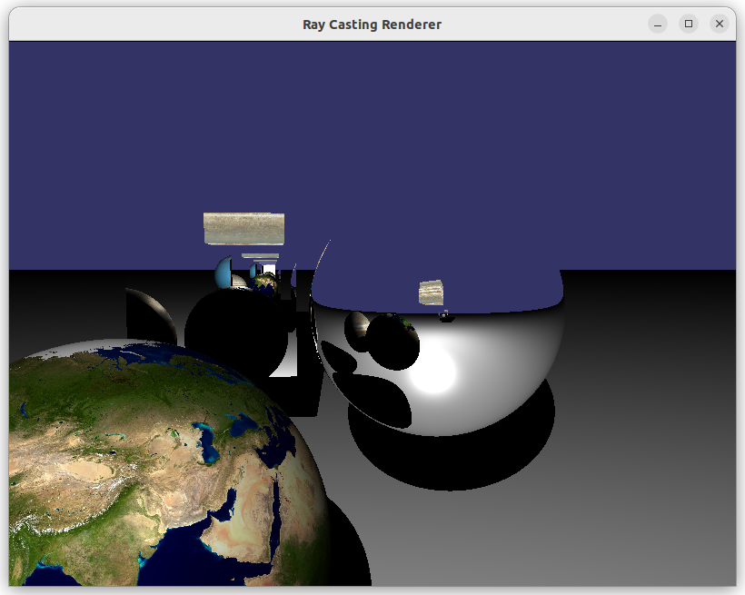
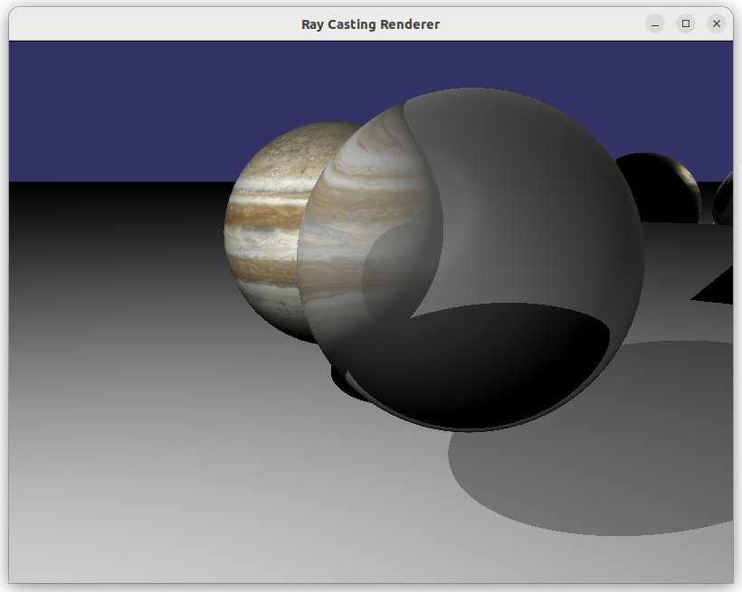
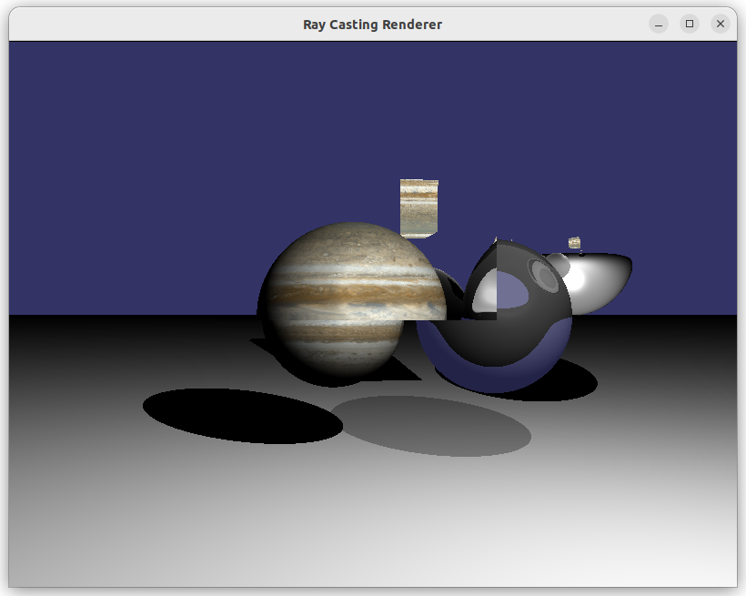
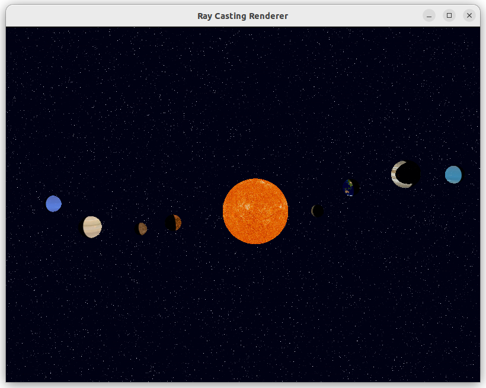

# JVAV Ray-Casting & Whitted Ray Tracing Engine

A real-time, interactive 3D rendering engine implemented in C++17 using OpenGL (GLUT). The project features a Whitted-style ray tracing pipeline rendering lighting, specular reflections, Snell's law refraction, textures, and interactive object manipulation.

---

## Highlights & Features

- **Dual Rendering Pipeline:**
  - **Ray Tracing Mode (`K`):** Whitted-style ray tracer with recursive reflection, refraction, Phong specular highlights, and shadow testing.
  - **Object Preview Mode:** High-speed preview pass displaying base colors and scene geometries.
- **Supported Geometric Primitives:**
  - **Spheres:** Analytical quadric intersection with spherical UV texture mapping.
  - **Planes:** Infinite planar surfaces with floor-mapped UV repeating textures.
  - **Boxes (AABB):** Axis-Aligned Bounding Boxes computed via the Slab algorithm with planar side projections.
- **Lighting & Optics:**
  - **Phong Shading Model:** Multi-source illumination with configurable diffuse and specular shininess coefficients.
  - **Light Sources:** Point light emitters and surface-emitting primitives.
  - **Shadow Mapping:** Direct ray-casting shadow rays with transparency attenuation.
  - **Specular Reflection:** Recursive ray tracing for mirror-like surfaces.
  - **Refraction & Transparency:** Snell's law transmission with Total Internal Reflection (TIR) support for dielectric materials (glass, water, diamond).
- **Interactive First-Person Camera:** Mouse look (yaw/pitch rotation) and WASD 6-DOF camera movement.
- **Real-Time Scene Object Manipulator:** Switch modes to translate scene primitives and tune RGB luminosity values at runtime.
- **JSON Scene Specification:** Load arbitrary 3D scenes externally without recompiling.

---

## Architecture Overview

The engine follows an object-oriented, decoupled architecture designed for extensibility and clarity:

| Header / Module | Description |
| :--- | :--- |
| [`vec3.hpp`](src/vec3.hpp) | 3D vector math struct supporting arithmetic, dot/cross products, normalization, and angle calculations. |
| [`color.hpp`](src/color.hpp) | Floating-point RGB color class with arithmetic scaling and range clamping. |
| [`ray.hpp`](src/ray.hpp) | Ray primitive defined by 3D origin point and normalized direction vector. |
| [`hitinfo.hpp`](src/hitinfo.hpp) | Intersection payload struct storing hit distance $t$, point, surface normal, and UV coordinates. |
| [`texture.hpp`](src/texture.hpp) | Texture mapping wrapper utilizing `stb_image` for image loading and solid color fallbacks. |
| [`object.hpp`](src/object.hpp) | Abstract Base Class defining polymorphic ray-primitive intersection, movement, and material interfaces. |
| [`sphere.hpp`](src/sphere.hpp), [`plane.hpp`](src/plane.hpp), [`box.hpp`](src/box.hpp) | Geometric primitive implementations derived from `Object`. |
| [`light_point.hpp`](src/light_point.hpp) | Point light source primitive. |
| [`scene.hpp`](src/scene.hpp) | Scene container maintaining active object collections and dynamic transformation dispatches. |
| [`camera.hpp`](src/camera.hpp) | Perspective camera generating primary viewing rays given normalized UV coordinates. |
| [`ray_casting_renderer.hpp`](src/ray_casting_renderer.hpp) | Core Whitted-style recursive ray tracing pipeline engine. |
| [`ray_object_renderer.hpp`](src/ray_object_renderer.hpp) | Lightweight raster-like scene preview renderer. |
| [`main.cpp`](src/main.cpp) | Application entry point, GLUT windowing loop, user input callbacks, and JSON scene parser. |

---

## Prerequisites & Dependencies

### Dependencies
- **C++ Compiler:** C++17 compatible compiler (`g++` 7+, `clang++`, or MSVC).
- **Graphics Libraries:** OpenGL runtime & development headers, GLU, and GLUT / `freeglut`.
- **Build System:** `make`.

### Installation

#### Linux (Ubuntu / Debian)
```bash
sudo apt update
sudo apt install build-essential freeglut3-dev libgl1-mesa-dev libglu1-mesa-dev make
```

#### Linux (Arch Linux)
```bash
sudo pacman -S base-devel freeglut mesa glu make
```

#### macOS (Homebrew)
```bash
brew install freeglut make
```

---

## Building & Running

### 1. Compile & Run Default Scene
To build and immediately launch the default scene:
```bash
make run
```

Or build only:
```bash
make
```

### 2. Run with Custom JSON Scene
You can pass custom scene configuration files as arguments:
```bash
./build/jvav_raycasting worlds/exemple.json
```

### 3. Rebuild or Clean
```bash
# Clean build artifacts
make clean

# Full clean rebuild and execution
make rebuild
```

---

## Controls & Keyboard Shortcuts

The application features two primary control modes: **Camera Mode** and **Object Mode**. Press `X` to toggle between them.

### General Controls
| Key | Action |
| :--- | :--- |
| `ESC` | Exit application |
| `K` | Toggle Ray Casting rendering on / off |
| `T` | Toggle frame rendering time monitor (ms) |
| `X` | Switch between **Camera Control Mode** and **Object Control Mode** |
| `Z` / `z` | Increase / decrease maximum ray recursion depth |
| `F` / `f` | Increase / decrease Camera Field of View (FOV) |
| `Mouse` | Rotate camera view direction (First-person look) |

### Camera Control Mode (`cameraMode = true`)
| Key | Action |
| :--- | :--- |
| `W` / `S` | Move camera Forward / Backward |
| `A` / `D` | Strafe camera Left / Right |
| `Space` | Move camera Up |
| `C` | Move camera Down |

### Object Control Mode (`cameraMode = false`)
| Key | Action |
| :--- | :--- |
| `←` / `→` | Cycle selection through scene objects |
| `W` / `S` | Move selected object Forward / Backward |
| `A` / `D` | Move selected object Left / Right |
| `Space` | Move selected object Up |
| `C` | Move selected object Down |
| `L` / `l` | Increase / decrease overall object luminosity |
| `R` / `r` | Increase / decrease Red channel luminosity |
| `G` / `g` | Increase / decrease Green channel luminosity |
| `B` / `b` | Increase / decrease Blue channel luminosity |

---

## Scene File JSON Format

Scenes can be fully defined in `.json` files. Here is an example scene configuration:

```json
[
  {
    "type": "sphere",
    "center": [0, 1, -5],
    "radius": 1.0,
    "color": [0.2, 0.7, 0.8],
    "specular": 64,
    "reflection": 0.5,
    "transparency": 0.2,
    "refractiveIndex": 1.3,
    "texture": "assets/marble.png",
    "emitter": false
  },
  {
    "type": "plane",
    "point": [0, 0, 0],
    "normal": [0, 1, 0],
    "color": [0.8, 0.8, 0.8],
    "specular": 16,
    "reflection": 0.1,
    "texture": "assets/floor.png"
  },
  {
    "type": "box",
    "minCorner": [-1, 0, -8],
    "maxCorner": [1, 2, -6],
    "color": [1.0, 0.0, 0.0],
    "specular": 32,
    "reflection": 0.3,
    "transparency": 0.5,
    "refractiveIndex": 1.5,
    "texture": "assets/brick.png",
    "emitter": false
  },
  {
    "type": "light_point",
    "position": [5, 10, 5],
    "color": [1.0, 1.0, 1.0]
  }
]
```

---

## Gallery & Rendering Demos

| Luminous Texture Sphere | Solid Color Light Cube |
| :---: | :---: |
|  |  |

| Mirror Surface Plane | Mirror Sphere Reflection |
| :---: | :---: |
|  |  |

| Refractive Glass Sphere | Transparent Box |
| :---: | :---: |
|  |  |

| Solar System Scene Demo |
| :---: |
|  |

---

## License

This project is open-source and free to use for personal and educational purposes.
